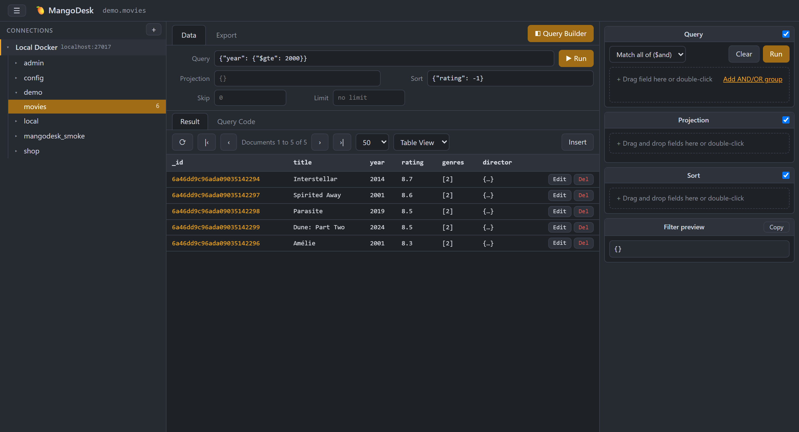

# 🥭 MangoDesk

Free Studio 3T-style MongoDB GUI. Local web app: Node + Express + the official
`mongodb` driver, vanilla-JS frontend, no build step.



## Run

```
npm install
npm start
```

Open http://localhost:27080 (override with `PORT`). The server listens on
127.0.0.1 only — the API exposes stored credentials and unauthenticated DB access.

## Features

- **Connections** — startup connection picker; settings form (host, port,
  user/password, auth DB, TLS, extra options) or a raw connection string, with
  test-before-save. Stored in `connections.json` next to the app (plaintext — local tool).
- **Data browser** — collapsible sidebar with a connection → databases → collections
  tree (document counts); Table / Tree / JSON views; first/prev/next/last pagination,
  column-click sorting, filter box (Extended JSON); insert / edit / delete documents
  in a modal editor.
- **Query Builder** — drag fields from the sampled schema into AND/OR condition
  groups; type-aware operators and value inputs (ObjectId, date, number, boolean);
  drag-to-sort and drag-to-projection strips; live filter preview; Run sends the
  query to the Data tab.
- **Export** — current query results as JSON array, NDJSON, or CSV (streamed).

## No local MongoDB?

```
docker run -d --name mangodesk-test -p 27017:27017 mongo:7
```

then connect to `mongodb://localhost:27017`.

## License

MIT — see [LICENSE](LICENSE).
